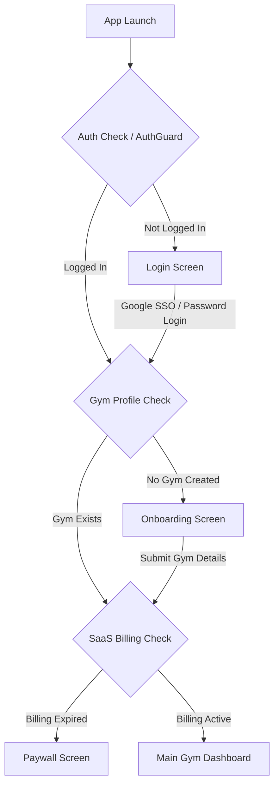

# 🏋️ Fitnex GYM App - Gym Owner SaaS Platform

Fitnex GYM is a premium, multi-tenant Gym Management SaaS platform built with Flutter (Cross-platform Mobile/Desktop) and a secure Node.js + PostgreSQL backend.

---

## 🌟 Application Flow Architecture



---

## 📱 Detailed Screen Breakdown & Features

### 1. 🔑 Auth & Session Management
- **Login Screen** (`lib/screens/auth/login_screen.dart`):
  - Standard Email & Password Authentication.
  - **Google One-Tap / SSO**: One-click Google authentication via OAuth Client ID.
  - Form input validation (valid email format, minimum 12-char password).
  - Encrypted token storage in `FlutterSecureStorage`.

- **Auth Guard Middleware** (`lib/middleware/auth_guard.dart`):
  - Intercepts routing on startup and session changes.
  - Guarantees unauthenticated users cannot bypass `/login`.
  - Gracefully handles offline and backend network fallbacks.

---

### 2. 🚀 Gym Onboarding
- **Onboarding Screen** (`lib/screens/auth/onboarding_screen.dart`):
  - Displayed for newly registered gym owners.
  - Prompts for **Gym Name**, **Address**, **Contact Number**, and **Currency** (INR).
  - Automatically provisions a new multi-tenant `gym_id` associated with the owner's `user_id`.

---

### 3. 📊 Main Gym Dashboard (`lib/screens/dashboard/dashboard_screen.dart`)
The core command center for gym owners displaying live business metrics:
- **Active Members Count**: Total active vs expired memberships.
- **Monthly Revenue Counter**: Live aggregated earnings for the current month.
- **Hot Leads Pipeline**: Quick overview of prospective gym inquiries.
- **Quick Action Bar**: Fast shortcuts to Add Member, Record Fee Payment, or Create Diet Plan.

---

### 4. 👥 Member Management (`lib/screens/members/`)
- **Members List Screen**: Search, filter by active/expired status, and view detailed member cards.
- **Add / Edit Member Form**:
  - Member Name, Mobile Number, Email Address.
  - Assigned Membership Plan (Monthly, Quarterly, Annual).
  - Start Date & Expiry Date automatic calculation.
- **Member Details Sheet**: View payment history, subscription status, and send WhatsApp renewal reminders.

---

### 5. 🎯 Leads & Sales Pipeline (`lib/screens/leads/`)
- Track potential leads visiting the gym.
- Categorize leads by status: **Hot** 🔥, **Warm** ☀️, **Cold** ❄️.
- Set follow-up call dates with automatic notification reminders.

---

### 6. 🥗 Diet & Workout Plan Builder (`lib/screens/diet/`)
- **Diet Plan Creator**:
  - Plan Title & Category (**Veg** / **Non-Veg**).
  - Calorie target breakdown (e.g., 2500 kcal).
  - Custom meal slots (Breakfast, Lunch, Pre-Workout, Dinner).
- Direct export and sharing with members.

---

### 7. 💳 Subscription Plans & Pricing (`lib/screens/plans/`)
- Define membership packages offered by your gym:
  - Plan Title (e.g., *Gold 3-Month Package*).
  - Duration in days (30, 90, 365).
  - Custom pricing with INR formatting.

---

### 8. 💸 Payments & Fee Collection (`lib/screens/payments/`)
- Record member fee payments and renewals.
- Issue digital receipts.
- Automatic revenue tracking in monthly reports.

---

### 9. 🔒 SaaS Paywall & Billing (`lib/screens/billing/`)
- Checks gym owner subscription status via `gym_billing`.
- Displays paywall screen when SaaS subscription requires renewal.

---

## 🗄️ Backend Architecture (Node.js + PostgreSQL)

The server codebase lives in `new_app/server`.

### 🛡️ Database Tables ([schema.sql](file:///e:/FitnexGYMApp-main/FitnexGYMApp-main/new_app/server/sql/schema.sql)):
- `users`: Account authentication credentials (email, hashed password, google_subject).
- `gyms`: Gym profiles owned by a user.
- `plans`: Gym subscription packages.
- `members`: Gym member records.
- `leads`: Sales inquiries and follow-ups.
- `diet_plans`: Meal and diet templates.
- `payments`: Financial collection transactions.
- `gym_billing`: SaaS subscription status for the gym owner.
- `revoked_tokens`: Invalidated JWT token blacklist.
- `security_audit_log`: OWASP security logging for critical actions.

---

## 🛠️ How to Run & Deploy

### 1. Local Development
```powershell
# Run Flutter App on Emulator
cd new_app
flutter run -d emulator-5554

# Run Backend Node Server locally
cd new_app/server
npm start
```

### 2. Live Oracle VPS Deployment
```powershell
# 1-Word SSH Login to your Oracle VPS
ssh oracle

# Connect backend app to Live VPS API
flutter run --dart-define=API_BASE_URL=http://80.225.214.213:3000
```
